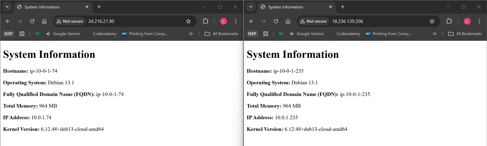

# ACIT4640 - Lab 7

## Commands:
### Create new keys
```
ssh-keygen -t ed25519 -C "your_email@example.com" -f ~/.ssh/aws
```
Creates a new SSH key. Saves the private key as aws and public key as aws.pub in the ~/.ssh directory.

### Run import_lab_key
```
./import_lab_key ~/.ssh/aws.pub
```
- Runs the script to upload new public key to AWS account.
---
### Terraform Commands Required:
#### Initializes your current working directory:
```
terraform init
```
- Downloads the necessary AWS provider plugins required to build the infrastructure.

---
#### Applies the terraform to create, update, or delete the infastructure:
```
terraform apply
```
- Executes the plan to build, change, or update your infrastructure (in this case, creating the two EC2 instances)

---

### Ansible Commands Required:
#### Check if hosts are reachable:
```
ansible all -m ping
```
- Uses the ping module to connect to all hosts defined in your inventory to confirm they are reachable and ready for Ansible commands.

---

#### Check playbook syntax:
```
ansible-playbook --syntax-check playbook.yml
```
- Checks your playbook.yml file for any YAML syntax errors or typos without connecting to the servers.

#### Dry run to simulate all changes:
```
ansible-playbook playbook.yml --check
```
- Performs a dry run by connecting to the hosts and simulating every task. It reports what would have changed but makes no actual modifications

---

#### Run the playbook to apply:
```
ansible-playbook playbook.yml
```
- Executes the playbook, running all defined tasks (installing Nginx, copying files, etc.) to configure your servers.

---

### Delete & Clean

#### Remove keys from AWS
```
./delete_lsb_key
```
Cleanup script to remove lab's SSH key to AWS account

### Destroy the instances
```
terraform destroy
```
Removes all resources that were created by this Terraform configuration.

---

### Screenshots
